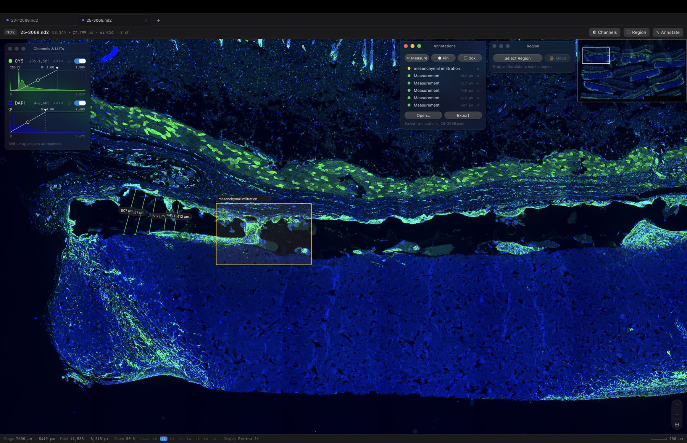

<p align="center">
  
</p>

<h1 align="center">nd2wsi-viewer</h1>

<p align="center">
  <b>Whole-slide viewing for Nikon ND2 and Aperio SVS, as a native macOS app and a CLI,<br>
  with pixel-exact ROI export back to ND2.</b>
</p>

<p align="center">
  
  
  
  
  
</p>

---

## Why this exists

A pathology viewer opens a two-gigabyte H&E slide in a second. You fly out
to the whole section, dive to a single nucleus, and never wait. Nikon's NIS
viewers give stitched ND2 scans no such treatment, and NIS-Elements does
not run on a Mac. I scan slides on a Ti2, read H&E slides from Aperio
scanners, and work on a Mac, so I built the viewer I wanted.

It also does the one thing pathology viewers skip. It crops any region back
out as a real ND2 that reopens in NIS-Elements with its calibration and
channels intact.

<p align="center">
  
  <br><sub>Two slides open as tabs. Serial thickness measurements and a labeled box on a PDGFR&beta; slide, loaded from its sidecar.</sub>
</p>

## How it works

The pipeline is short: slide to OME-Zarr pyramid, pyramid to local tile
server, tile server to deep-zoom viewer. The pyramid is built once, next to
the slide, with bounded memory. After that a five-gigabyte scan pans and
zooms fluidly, because the viewer touches only the tiles on screen. An SVS
file takes the same path. The reader pulls the baseline level of the
pyramidal TIFF through tifffile and takes the micron calibration from the
Aperio MPP field.

```
pip install .
nd2wsi view slide.nd2 another.svs
# builds pyramid_<name>.ome.zarr next to each slide (once),
# then opens the tabbed viewer at http://127.0.0.1:8000
```

To skip the terminal, run `packaging/build_mac_app.sh`. It produces a
double-clickable `nd2wsi-viewer.app` and a drag-to-Applications `.dmg` with
everything bundled.

## Install

```bash
pip install .            # nd2, numpy, dask, zarr, numcodecs, pillow, tifffile
pip install ".[svs]"     # adds imagecodecs, for Aperio SVS
pip install ".[app]"     # adds pywebview, for the native macOS window
pip install ".[legacy]"  # adds imagecodecs, for pre-2012 JPEG2000 ND2

# ND2 export uses limnd2, published on Laboratory Imaging's own index:
pip install --index-url https://pypi.laboratory-imaging.com/simple limnd2
```

Python 3.10 or newer. The server is stdlib http.server, OpenSeadragon is
vendored, and viewing works offline.

## Commands

```text
nd2wsi info    slide.nd2|.svs    # internal layout: chunk census, pyramid,
                                 # compression, calibration, stage positions
nd2wsi convert slide.nd2 [out.ome.zarr] [--tile 512] [--t N] [--z mid|max|N]
                                 [--position N] [--workers N] [--overwrite]
nd2wsi crop    slide.nd2 roi.nd2 --x X --y Y --w W --h H [--c 0,1]
                                 # native-resolution ND2 to ND2 crop, straight
                                 # off the memory map, no pyramid needed
nd2wsi serve   a.ome.zarr [b.ome.zarr ...]   # one tab per store
nd2wsi view    one.nd2 [two.svs ...]         # convert if needed, then serve
nd2wsi-viewer  [slide.nd2|.svs]              # native macOS window
```

`convert` sizes its thread pool to your CPU, and `--workers` overrides it.
Each store holds one 2D plane. Pick the timepoint with `--t`, the Z plane
with `--z` (an index, `mid`, or `max` for a maximum-intensity projection),
and the stage position with `--position`. RGB slides are stored as C=3.

## The viewer

The root page is a browser-style tab strip. Each slide gets a tab, the `+`
button opens another, and dropping a file onto the window works too. Each
tab keeps its own viewer state while open.

The files created next to a slide name themselves. `pyramid_<slide>.ome.zarr`
holds the viewing cache and `annotations_<slide>.json` holds the
annotations. Older unprefixed names still load and migrate.

The design follows the macOS design language, with control values measured
from Apple's macOS 27 UI kit: SF Pro and SF Mono type, translucent panels
over the slide, capsule controls with specular edges, and kit-geometry
switches. Each panel is a small mac window. Drag it by the title bar,
resize it from any edge, and use the traffic lights to close, collapse, or
zoom it. The viewer remembers the geometry.

### Channels and LUTs

<p align="center">
  
  <br><sub>Two-channel immunofluorescence (CY5 and DAPI). The histograms grow when you widen the window.</sub>
</p>

Every channel shows its intensity histogram in the channel color, in the
layout of the NIS-Elements LUTs panel. The black and white triangles set
the display window in raw counts. The knob on the mapping curve sets gamma,
from 0.25 to 4, and gamma above 1 brightens midtones. `Auto` stretches the
window to the 0.1 to 99.9 percentile of the histogram. Shift-drag moves all
channels together. Each channel has a reset and an on-off switch, and the
viewer handles any channel count.

### Measure and annotate

<p align="center">
  
  <br><sub>A CD31 slide with pins on ring-shaped vessel profiles, a 354 &micro;m distance, and a boxed field. The sidecar loaded all of it on open.</sub>
</p>

Press `M` and drag to measure a distance in microns. The math uses the
file's own pixel calibration and respects anisotropic pixels. Press `P` to
drop a pin or `B` to draw a box, and type a note on either. The colored dot
beside each list item cycles it through the Apple system palette. Clicking
an item flies to it.

Annotations save themselves to `annotations_<slide>.json` beside the slide,
never into the ND2. The next open finds the file again, and `Open` and
`Export` move the same plain JSON in and out.

### Region export

<p align="center">
  
  <br><sub>A selected region. The pixel and micron fields edit the box directly, and ND2 is the default export.</sub>
</p>

Press `R` and drag a rectangle. To hit an exact size, type it: the Pixels
and Physical fields edit the region directly and stay in sync through the
slide's calibration. The Move button (or `V`) turns the cursor into a hand
that drags the region across the slide with its size locked. Exports come
out at native resolution in four formats.

* **ND2**, the default. A real, uncompressed ND2 that carries the source
  calibration, channel names, colors, and objective magnification. It
  reopens in NIS-Elements and round-trips through this tool.
* **TIFF**. Raw pixel values in the original dtype, tiled, with the pixel
  size in the resolution tags.
* **PNG and JPEG**. Rendered exactly as displayed, current LUTs included,
  capped by `--max-render-mpx` (default 100 MPx).

ND2 and TIFF stream, so any size works, the whole slide included.

### Scripting

Everything the UI does is plain HTTP.

```
GET  /api/slides                 open slides and their ids
POST /api/open                   {"path": ...} converts if needed, adds a tab
GET  /s/<sid>/api/info
GET  /s/<sid>/api/histogram
GET  /s/<sid>/api/tile/{level}/{x}/{y}.jpg?c=0,2&win=399:1057,220:2366:2.0
GET  /s/<sid>/api/roi?level=0&x=...&y=...&w=...&h=...&format=nd2|tiff|png|jpg
GET  /s/<sid>/api/annotations    sidecar contents
POST /s/<sid>/api/annotations    {"items": [...]} writes the sidecar atomically
```

Bare `/api/...` addresses the first slide, which keeps single-slide scripts
simple. `win` takes one `lo:hi[:gamma]` slot per channel, and an empty slot
keeps the stored default.

## The macOS app

`nd2wsi-viewer` wraps the same server in a native WKWebView window. It
opens to a black drop target. Drop an `.nd2` or `.svs`, or click to browse.
The first open builds the pyramid, and the viewer loads from an ephemeral
localhost port.

`packaging/build_mac_app.sh` bundles Python and every dependency with
PyInstaller, signs the bundle ad hoc, self-tests it headlessly, and wraps
it in a `.dmg`. Ad-hoc signing suits direct hand-offs. Public distribution
also needs a Developer ID and notarization.

## Inside a stitched ND2

The question that started this project: does a stitched ND2 keep its
acquisition tiles, or is it one flattened raster? Run `nd2wsi info` on your
own files for the answer. On ours it was unambiguous.

* A modern ND2 stores pixel data as one ImageDataSeq blob per frame and
  never splits a frame spatially. A stitched scan is a single frame, so it
  is one contiguous raster. The acquisition tiles do not survive stitching.
* An uncompressed ND2 is efficiently seekable. The reader hands out
  zero-copy views onto a memory map, so cropping a small ROI from a
  multi-gigabyte slide touches only the pages it needs. Files saved with
  zlib compression lose this property.
* Multipoint files saved unstitched keep per-tile frames and micron stage
  positions. The tiles are addressable, and stitching becomes your job.

The slide is flat but seekable. Interactive viewing needs a pyramid and a
tile protocol, which OME-Zarr and OpenSeadragon supply. This tool is the
bridge between them.

## Measured on real Ti2 scans

Five 20x "Scan Large Image" acquisitions from an ECLIPSE Ti2 with
NIS-Elements AR 2022 (two-channel CY5 and DAPI uint16, 0.66 um/px, 1.4 to
5.5 GB per file) all showed the same layout: exactly one uncompressed
ImageDataSeq blob, no surviving tiles, no embedded pyramid. Conversion on
an Apple-silicon laptop with 14 cores:

| slide (px)      | ND2    | convert | pyramid on disk |
|-----------------|--------|---------|-----------------|
| 19,029 x 19,171 | 1.4 GB |   7.3 s | 1.0 GB (7 levels) |
| 20,064 x 34,271 | 2.6 GB |  15.1 s | 1.9 GB (8 levels) |
| 53,144 x 27,799 | 5.5 GB |  49.2 s | 3.8 GB (8 levels) |

On the 1.48-gigapixel slide, one zoom gesture fetched tiles from level 6
down to level 0 in order and ended with only the visible native tiles. An
11,957 x 7,972 px region (364 MB raw) exported as TIFF in 2.4 s and as a
new ND2 through `nd2wsi crop` in 14 s. Both exports matched the source
memory map pixel for pixel, and the calibration, channel names, display
colors, and objective magnification carried over.

## Tests

pytest runs 16 tests. They verify that ND2 exports round-trip pixel-exact
through the independent nd2 reader with calibration and channel metadata
preserved, that three-channel files convert, render histograms, and export,
that the annotation sidecar survives a GET and POST round-trip on disk,
that multi-slide routing serves each slide and closes cleanly, and that the
LUT parsing and compositing math behave. The stores also open in the
official ome-zarr-py reader, so napari and vizarr read them directly.

`scripts/make_synthetic_nd2.py` generates fixtures with the same internal
shape as real stitched scans, using Laboratory Imaging's own limnd2 writer.
The export tests skip when limnd2 is absent.

## Architecture

```
 slide.nd2 --(nd2 mmap, zero-copy frame view)--+
                                               |  dask: (1, tile, tile) chunks
                                               v
                     pyramid_<name>.ome.zarr   0/ 1/ 2/ ... (NGFF 0.4, zstd)
                                               |
                 stdlib ThreadingHTTPServer ---+
                   /api/tile -> JPEG/PNG       |   /api/roi -> ND2, tiled TIFF
                   (windowed composite)        v   (streamed, raw dtype)
                          OpenSeadragon custom tile source (vendored)
```

* `convert.py` writes level 0 straight from memory-map slices, then
  computes each further level as a 2x2 mean of the one before it, so
  memory never depends on slide size.
* `render.py` composites tiles and streams ROI exports.
* `export_nd2.py` writes ROIs back to ND2 through limnd2, one 512-row band
  at a time.
* `server.py` and `static/` serve the tabs, the tiles, and the viewer.

## Limitations

* Each store holds one 2D plane. Choose T, Z, and position at convert
  time, and convert again for another plane.
* ND2 export needs limnd2 (see Install) and covers uint8 and uint16
  sources. Without it the ND2 button explains itself, and TIFF, PNG, and
  JPEG still work.
* zlib-compressed ND2 frames resist memory-map slicing, so converting a
  compressed stitched slide loads the whole frame. Re-save uncompressed,
  or use bioformats2raw.
* Files that combine multiple channels with RGB components are rejected.
* For pre-2012 JPEG2000 ND2 files, `info` works, and `convert` needs the
  `[legacy]` extra and loads whole frames.
* The server is a single-user local viewer, not a hardened web service.

## Related work

* **limnd2**, Laboratory Imaging's own Python ND2 SDK: reader, writer, and
  OME-Zarr exporter. Its exporter loads whole frames, which breaks on giant
  stitched scans. That gap is what this tool fills.
* **nis2pyr** converts ND2 to pyramidal OME-TIFF for viewing in QuPath.
* **QuPath with Bio-Formats** opens ND2 directly, as a full analysis suite.
* **bioformats2raw** converts ND2 to OME-Zarr on the JVM.
* **large-image-source-nd2** is Kitware's ND2 tile source for Girder.

MIT licensed. OpenSeadragon (BSD-3) is bundled under
`nd2wsi/static/vendor/openseadragon/`.
