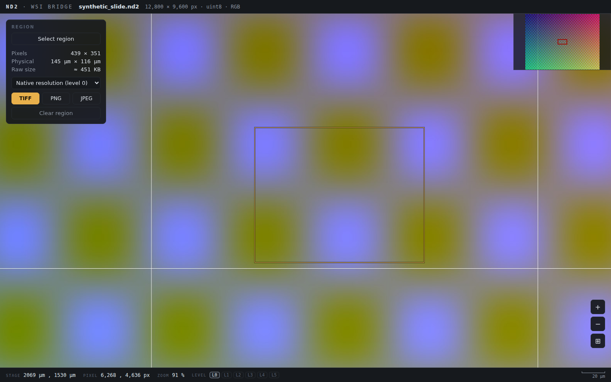

# nd2-wsi-bridge

**Nikon ND2 → OME-Zarr pyramid → browser slide viewer, with native-resolution
ROI export back to ND2 — in one command, without ever loading the slide into
RAM.**

```
pip install .
nd2wsi view my_stitched_slide.nd2
# → converts to my_stitched_slide.ome.zarr (once), opens http://127.0.0.1:8000
```

Built for large stitched acquisitions from NIS-Elements ("Scan Large Image" /
XY-stitched scans on Ti2-class stands), but works on any 2D-viewable ND2 plane.



## Why this exists — what's actually inside a stitched ND2

The question that started this project: *does a stitched ND2 keep its
acquisition tiles, or is it one flattened raster?* Empirically (see
`nd2wsi info`, which runs the chunk census on your own files):

* A modern ND2 is a chunked container with a chunkmap. Pixel data lives in
  `ImageDataSeq|N!` chunks — exactly **one blob per frame** (per T/P/Z
  coordinate), never split spatially. A stitched scan is a single frame, so it
  is **one giant contiguous raster**; the original tiles do not survive
  stitching.
* But uncompressed ND2 is **efficiently seekable**: readers hand out zero-copy
  strided views onto a memory map, so cropping a small ROI from the middle of
  a multi-GB slide touches only the pages it needs. (Files saved with ND2's
  "lossless" zlib compression lose this property — the whole frame must be
  inflated.)
* NIS can embed its own preview pyramid
  (`CustomDataSeq|DownsampledColorData_*` chunks) depending on save settings —
  `nd2wsi info` reports whether yours has one.
* Multipoint files saved *unstitched* keep per-tile frames plus `XYPosLoop`
  stage positions in µm — addressable tiles, but stitching becomes your job.

So the slide is flat but seekable. What's missing for interactive viewing is a
**pyramid** and a **tile protocol** — which is exactly what OME-Zarr and
OpenSeadragon provide. This tool is the bridge: it streams the ND2 through a
Dask graph of memory-map slices into a multiscale OME-NGFF 0.4 Zarr store,
then serves it to a browser viewer with an ROI export endpoint that streams
raw pixels back out as tiled TIFF.

Measured on a 12,800 × 9,600 RGB slide (352 MB of pixels) in a small
container: conversion in ~29 s with heap bounded by `tile × workers` (not
slide size); exporting the *entire slide* as one native-resolution TIFF used
**14 MB** of additional heap.

### Validated on real Ti2 slide scans

Five 20× "Scan Large Image" acquisitions from an ECLIPSE Ti2 / NIS-Elements
AR 2022 (2-channel CY5 + DAPI uint16 immunofluorescence, 0.66 µm/px,
1.4–5.5 GB per file) all showed the same internal layout: **exactly one
uncompressed `ImageDataSeq|0!` blob** — one flattened raster, no surviving
acquisition tiles, no embedded preview pyramid. That is the best case for
this tool: the mmap streaming path applies unmodified.

End-to-end on an Apple-silicon laptop (14 cores, `--workers 8`):

| slide (px)      | ND2    | convert | pyramid on disk |
|-----------------|--------|---------|-----------------|
| 19,029 × 19,171 | 1.4 GB |   7.3 s | 1.0 GB (7 levels) |
| 20,064 × 34,271 | 2.6 GB |  15.1 s | 1.9 GB (8 levels) |
| 53,144 × 27,799 | 5.5 GB |  49.2 s | 3.8 GB (8 levels) |

On the 1.48-gigapixel slide the viewer pans/zooms fluidly from
whole-slide overview to native 1:1 — the network log for one zoom shows
tiles requested from level 6 down to level 0 in sequence, with only the
handful of visible native tiles fetched at the end. A 11,957 × 7,972 px
native-resolution ROI (364 MB raw) streamed out as a zlib TIFF in **2.4 s**,
and as a new **ND2** via `nd2wsi crop` (no pyramid needed) in **14 s**; both
exports verified pixel-identical to reading the same region straight from
the source ND2 memory map, with the µm calibration intact (TIFF resolution
tags / ND2 metadata) and, for ND2, the channel names, display colors and
objective magnification carried over. NIS-assigned channel colors (e.g. CY5
shown red in one staining batch, green in another) carry through to the
viewer via the ND2 metadata.

## Install

```bash
pip install .            # nd2, numpy, dask, zarr, numcodecs, pillow, tifffile
pip install ".[legacy]"  # + imagecodecs, for JPEG2000-era (pre-2012) ND2 files

# for ND2 export (the ND2 button / `nd2wsi crop`): limnd2 is on Laboratory
# Imaging's own package index, not PyPI --
pip install --index-url https://pypi.laboratory-imaging.com/simple limnd2
```

Python ≥ 3.10. No web framework — the server is stdlib `http.server`, and
OpenSeadragon 5.0.1 is vendored, so viewing works fully offline.

## Commands

```text
nd2wsi info    slide.nd2      # internal layout: chunk census, embedded pyramid,
                              # stage positions, compression, calibration
nd2wsi convert slide.nd2 [out.ome.zarr] [--tile 512] [--t N] [--z mid|max|N]
                              [--position N] [--workers 4] [--overwrite]
nd2wsi crop    slide.nd2 roi.nd2 --x X --y Y --w W --h H [--c 0,1] [--t/--z/--position]
                              # native-res ND2 -> ND2 crop, straight off the
                              # memory map -- no pyramid needed (needs limnd2)
nd2wsi serve   out.ome.zarr   [--host 127.0.0.1] [--port 8000]
nd2wsi view    slide.nd2      # convert if needed, then serve
```

`convert` picks one 2D plane (plus channels) per store: timepoint `--t`,
Z plane `--z` (an index, `mid`, or `max` for a maximum-intensity projection),
and `--position` for multipoint files. RGB slides are stored as C=3.

## The viewer

* Deep-zoom pan/scroll with a minimap; channel toggles for multichannel
  fluorescence (server-side additive compositing).
* **Per-channel LUTs**, laid out like the NIS-Elements LUTs panel: each
  channel (however many the file has) gets its intensity histogram drawn in
  the channel color, black/white triangles to drag the display window in raw
  counts, and a knob on the mapping curve that drags vertically to set gamma
  (0.25–4, NIS convention: γ > 1 brightens midtones) — live re-rendering, a
  per-channel reset, and shift-drag to adjust all channels together.
  Defaults come from percentile auto-windows computed at convert time;
  histograms come from `/api/histogram` (computed once per store, from a
  small pyramid level, robust to lone hot pixels).
* **Region export**: press `R` or *Select region*, drag a rectangle, and
  download — always at native resolution:
  * **ND2** (default) — a real, uncompressed modern ND2 with the source's
    µm calibration, channel names/colors and objective magnification;
    reopens in NIS-Elements (written with Laboratory Imaging's own `limnd2`)
    and round-trips through this tool. Streams at any size.
  * **TIFF** — raw pixel values, original dtype, tiled + zlib, with the true
    pixel size embedded in the resolution tags. Streams at any size.
  * **PNG / JPEG** — rendered exactly as displayed, current LUTs included
    (capped by `--max-render-mpx`, default 100 MPx).
* Status strip: live stage position in µm, pixel coordinates, zoom, the
  active pyramid level, and a real scale bar.

Everything the UI does is plain HTTP you can script:

```
GET /api/info
GET /api/histogram
GET /api/tile/{level}/{x}/{y}.jpg?c=0,2&win=399:1057,220:2366:2.0
GET /api/roi?level=0&x=6803&y=3517&w=1234&h=987&format=nd2&c=0,2
```

(`win` is one `lo:hi[:gamma]` slot per channel; empty slot = stored default.
`format` is `nd2` | `tiff` | `png` | `jpg`. The UI always exports level 0;
the `level` parameter remains for scripted downsampled reads.)

## Correctness

The test battery (run in CI-style against synthetic + real files) verifies:

* ROI TIFF and PNG exports are **pixel-identical** to reading the same region
  straight from the ND2 memory map — including unaligned regions, RGB uint8,
  planar multichannel uint16, and single-channel subsets;
* ND2 exports **round-trip**: `crop`/`format=nd2` output reopens in the
  independent `nd2` reader pixel-identical to the source region, with
  calibration, channel names/colors and magnification preserved
  (`tests/test_nd2_export.py`, skipped when `limnd2` is absent);
* `--z max --t N` matches a manual per-frame maximum (validating frame
  indexing on a real T×Z file);
* the stores open in the official `ome-zarr-py` reader (and therefore in
  napari via `napari-ome-zarr`, vizarr, etc.);
* the exported TIFF carries the correct µm calibration in its resolution tags;
* the web UI loads, zooms and draws ROIs without console errors (Playwright).

`pytest` covers the pure functions; `scripts/make_synthetic_nd2.py` generates
ND2 fixtures with the same internal shape as real stitched scans (one giant
`ImageDataSeq` blob), using Laboratory Imaging's own `limnd2` writer:

```bash
pip install --index-url https://pypi.laboratory-imaging.com/simple limnd2
python scripts/make_synthetic_nd2.py testdata/
python scripts/download_samples.py     # small real files from OME's collection
```

## Architecture

```
 slide.nd2 ──(nd2 mmap, zero-copy frame view)──┐
                                               │  dask: (1, tile, tile) chunks
                                               ▼
                     out.ome.zarr   0/ 1/ 2/ … (NGFF 0.4 multiscales, zstd)
                                               │
                 stdlib ThreadingHTTPServer ───┤
                   /api/tile → JPEG/PNG        │      /api/roi → tiled TIFF
                   (windowed composite)        ▼      (streamed, raw dtype)
                          OpenSeadragon custom tile source (vendored, offline)
```

* **convert.py** — level 0 is written straight from mmap frame slices; each
  further level is a 2×2 mean of the previous one, computed level-from-level
  so memory never depends on slide size.
* **render.py** — tile compositing (RGB passthrough or additive
  windowed-channel blend) and the streaming tiled-TIFF ROI writer.
* **server.py / static/** — the tile server and the viewer app.

## Limitations (honest ones)

* One 2D plane per store: T/Z/position are chosen at convert time, not
  browsable live. (Convert multiple stores if you need several planes.)
* ND2 export needs `limnd2`, which is only on Laboratory Imaging's package
  index (see Install); without it the ND2 button explains itself and
  TIFF/PNG/JPEG still work. ND2 export covers uint8/uint16 sources (which is
  what ND2 acquisitions are); exported files are uncompressed.
* The ND2 exporter reads the source one 512-row band at a time, so heap is
  bounded by `512 × ROI-width`; macOS may show a large *resident set* during
  big crops — that is the OS keeping clean, evictable memory-mapped file
  pages around, not process heap.
* zlib-compressed ND2 frames can't be mmap-sliced — conversion of a
  compressed *stitched* slide would need the whole frame in RAM. Consider
  `bioformats2raw` for those, or re-save uncompressed.
* Files with both multiple channels *and* RGB components are rejected.
* Legacy (JPEG2000-era) files: `info` works; `convert` needs
  `pip install ".[legacy]"` and loads whole frames.
* Single-user local viewer, not a hardened web service.

## Related work

* **limnd2** — Laboratory Imaging's (NIS-Elements' authors) own Python ND2
  SDK, MIT, reader *and* writer, with its own OME-Zarr export. Its exporter
  loads whole frames per task, which is exactly what breaks on giant stitched
  frames — the gap this tool fills. Their index also hosts an ND2 web viewer.
* **nis2pyr** — ND2 → pyramidal OME-TIFF (then view in QuPath).
* **QuPath + Bio-Formats** — full WSI analysis suite that opens ND2 directly.
* **bioformats2raw** — Java, robust ND2 → OME-Zarr for the cases above.
* **large-image-source-nd2** — Kitware's ND2 tile source for Girder.

MIT licensed. OpenSeadragon (BSD-3) is bundled under
`nd2wsi/static/vendor/openseadragon/`.
