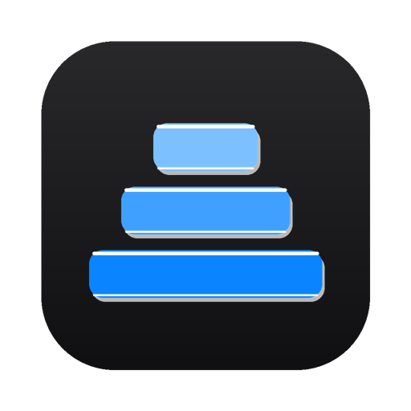
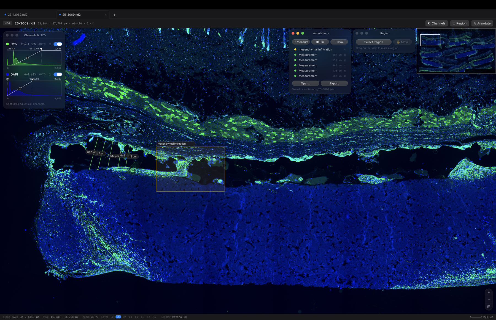
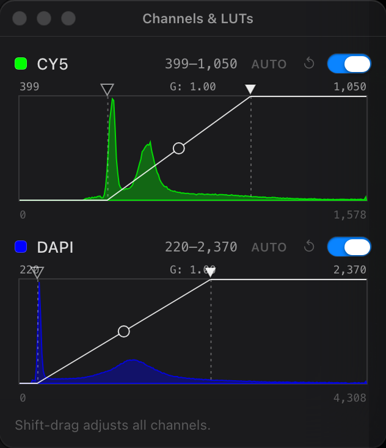
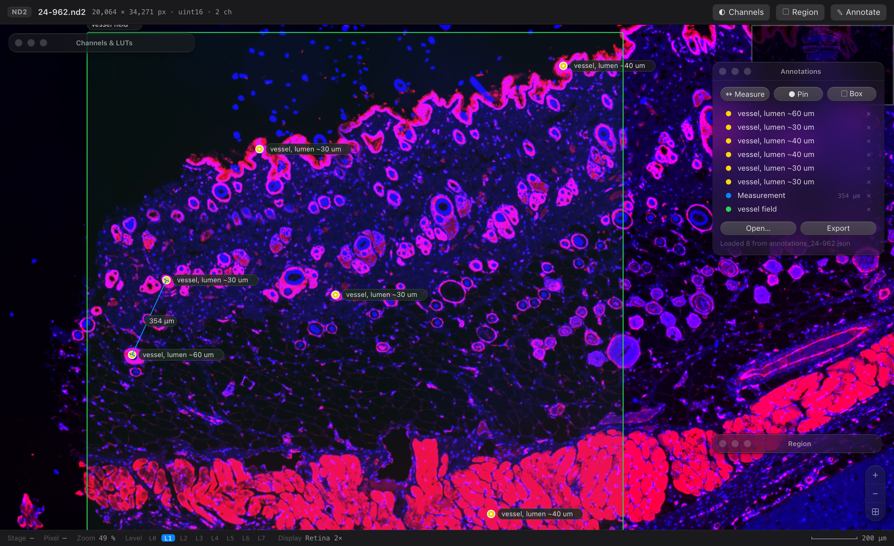
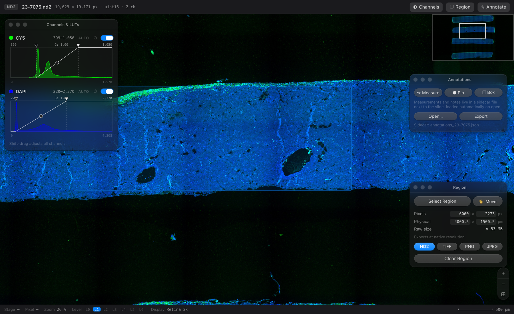
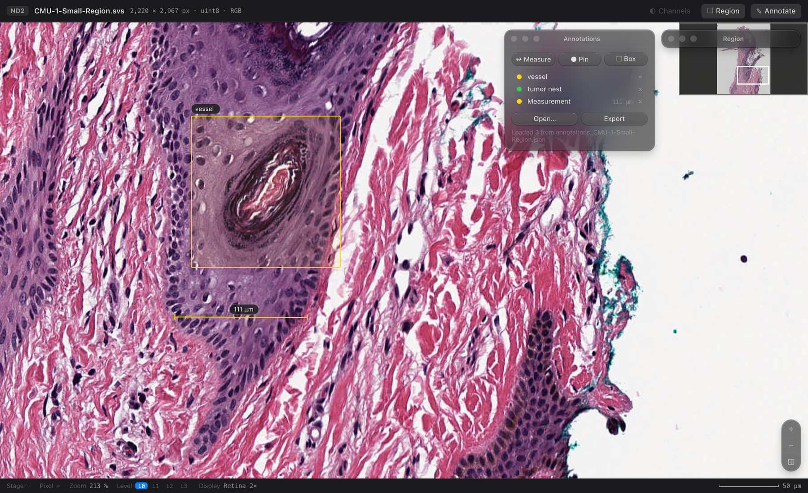

<p align="center">
  
</p>

<h1 align="center">nd2wsi-viewer</h1>

<p align="center">
  <b>Whole-slide viewing for Nikon ND2 and Aperio SVS, as a native macOS app and a CLI,<br>
  with pixel-exact ROI export back to ND2.</b>
</p>

<p align="center">
  
  
  
  
  
</p>

---

## Motivation

I routinely look up two kinds of slides every week. MT and H&E scans come
from a Leica Aperio scanner. Immunofluorescence scans come from a Nikon
Ti2 and are saved as ND2 by NIS-Elements. The pathology slides open
instantly in any WSI viewer. But I found my Mac struggling to open the
ND2 files, and for a while I was just angry at the computer.

Then I looked inside the files, and it turned out the computer was never
the problem. An Aperio SVS is a pyramid of small tiles at several zoom
levels, so a viewer only reads the handful of tiles on screen. A stitched
ND2 is one flat 5 GB image. Software that opens it has little choice but
to drag the whole thing through memory, and no laptop enjoys that.

Once you see it that way, the fix is obvious. RAM is fixed the day you
buy the machine. Storage is the one thing you can always add, and an
external SSD is cheap. So this viewer makes the trade on purpose. It
converts the ND2 once into a tiled pyramid on disk and never loads the
slide whole again. You pay roughly 70% of the
file size in storage, and in return a 5 GB scan pans and zooms like a map
on any Mac with room on its SSD. The cache lives next to the slide, so
keep your slides on an external drive and the speed travels with it.

It also does the one thing pathology viewers skip. Any region crops back
out as a real ND2 that reopens in NIS-Elements with its calibration and
channels intact.

<p align="center">
  
  <br><sub>Two slides open as tabs. Serial thickness measurements and a labeled box on a PDGFR&beta; slide, loaded from its sidecar.</sub>
</p>

## How it works

The pyramid format is [OME-Zarr](https://ngff.openmicroscopy.org/), the
bioimaging community's next-generation pyramidal format. Instead of one
giant blob, the image lives as thousands of small compressed chunks at
every zoom level, which is exactly the shape a deep-zoom viewer wants to
read. It's an open standard, so a store made with `nd2wsi convert` also
opens in napari, vizarr, and QuPath.

The pipeline is short. A slide becomes an OME-Zarr pyramid, the pyramid
feeds a local tile server, and the server feeds a deep-zoom viewer in a
browser tab or the app window. Conversion happens once, next to the slide, with bounded memory
and a progress bar. SVS files take the same path. The reader pulls the
baseline level of the pyramidal TIFF through tifffile and takes the micron
calibration from the Aperio MPP field.

```
pip install .
nd2wsi view slide.nd2 another.svs
# builds a cache under nd2wsi/ next to each slide (once),
# then opens the tabbed viewer at http://127.0.0.1:8000
```

If you would rather skip the terminal, `packaging/build_mac_app.sh`
builds a double-clickable `nd2wsi-viewer.app` and a drag-to-Applications
`.dmg` with everything bundled.

## Install

```bash
pip install .            # nd2, numpy, dask, zarr, numcodecs, pillow, tifffile
pip install ".[svs]"     # adds imagecodecs, for Aperio SVS
pip install ".[app]"     # adds pywebview, for the native macOS window
pip install ".[legacy]"  # adds imagecodecs, for pre-2012 JPEG2000 ND2

# ND2 export uses limnd2, published on Laboratory Imaging's own index
pip install --index-url https://pypi.laboratory-imaging.com/simple limnd2
```

Python 3.11 or newer. The server is stdlib `http.server`, OpenSeadragon is
vendored, and viewing works offline.

## Commands

```text
nd2wsi info    slide.nd2|.svs    # chunk census, embedded pyramid,
                                 # compression, calibration, stage positions
nd2wsi convert slide.nd2 [out.ome.zarr] [--tile 512] [--t N] [--z mid|max|N]
                                 [--position N] [--workers N] [--overwrite]
nd2wsi crop    slide.nd2 roi.nd2 --x X --y Y --w W --h H [--c 0,1]
                                 # native-resolution ND2 to ND2 crop, straight
                                 # off the memory map, no pyramid needed
nd2wsi serve   a.ome.zarr [b.ome.zarr ...]   # one tab per store
nd2wsi view    one.nd2 [two.svs ...]         # convert if needed, then serve
nd2wsi-viewer  [slide.nd2|.svs]              # native macOS window
```

`convert` sizes its thread pool to your CPU, and `--workers` overrides it.
Each store holds one 2D plane. Pick the timepoint with `--t`, the Z plane
with `--z` (an index, `mid`, or `max` for a maximum-intensity projection),
and the stage position with `--position`. RGB slides are stored as C=3.

## The viewer

The root page is a browser-style tab strip. Each slide gets a tab, the `+`
button opens another, and you can just drop a file onto the window. Every
tab keeps its own viewer state while open. A first-time open shows the
conversion progress right in the tab.

Everything the app writes next to a slide lives in one `nd2wsi` folder,
described under "Where the caches live" below. When you want the disk
space back, the trashcan button in the toolbar deletes that slide's cache
after a confirm. Your annotations and the source slide stay, and the
slide simply rebuilds its cache on its next open.

The look follows the macOS design language, with control geometry
measured from Apple's macOS 27 UI kit. Expect SF Pro and SF Mono type,
translucent panels over the slide, and capsule controls with specular
edges. Each panel is a little mac window. Drag it by the title bar, resize it from any edge, and
use the traffic lights to close, collapse, or zoom it. The viewer
remembers where you put things. A sun and moon button next to the
trashcan switches the whole viewer between dark and light, and the choice
sticks across slides and sessions.

### Channels and LUTs

<p align="center">
  
  <br><sub>Two-channel immunofluorescence (CY5 and DAPI). The histograms grow when you widen the window.</sub>
</p>

Every channel gets its intensity histogram in the channel color, laid out
like the NIS-Elements LUTs panel. The black and white triangles set the
display window in raw counts. The knob on the curve sets gamma, from 0.25
to 4, and gamma above 1 brightens midtones. `Auto` stretches the window to
the 0.1 to 99.9 percentile. Shift-drag moves all channels together. Each
channel has a reset and an on-off switch, and any channel count works.

### Measure and annotate

<p align="center">
  
  <br><sub>A CD31 slide with pins on ring-shaped vessel profiles, a 354 &micro;m distance, and a boxed field. The sidecar loaded all of it on open.</sub>
</p>

Press `M` and drag to measure a distance in microns, using the file's own
pixel calibration (anisotropic pixels included). Press `P` to drop a pin
or `B` to draw a box, and type a note on either. The colored dot beside
each list item cycles through the Apple system palette. Click an item and
the view flies to it.

Annotations save themselves to `annotations_<slide>.json` beside the
slide, never into the ND2. The next open finds the file again, and `Open`
and `Export` move the same plain JSON in and out.

### Region export

<p align="center">
  
  <br><sub>A selected region. The pixel and micron fields edit the box directly, and ND2 is the default export.</sub>
</p>

Press `R` and drag a rectangle. To hit an exact size, type it into the
Pixels or Physical fields. They edit the region directly and stay in sync
through the slide's calibration. The Move button (or `V`) turns the cursor into a hand
that slides the region around with its size locked. Exports always come
out at native resolution, with a progress gauge in the status bar.

* **ND2**, the default. A real, uncompressed ND2 carrying the source
  calibration, channel names, colors, and objective magnification. It
  reopens in NIS-Elements and round-trips through this tool.
* **TIFF**. Raw pixel values in the original dtype, tiled, with the pixel
  size in the resolution tags.
* **PNG and JPEG**. Rendered exactly as displayed, current LUTs included,
  capped by `--max-render-mpx` (default 100 MPx).

ND2 and TIFF stream, so any size works, the whole slide included.

### SVS input

<p align="center">
  
  <br><sub>An Aperio SVS slide in the same viewer. A boxed vessel, a 111 &micro;m measurement, and the sidecar annotations loaded on open.</sub>
</p>

Brightfield H&E works with every tool above, unchanged. An SVS opens in the
light theme, since that is how these stains are read.

An SVS opens with no conversion at all. The file already carries a
pyramid, typically 1x, 4x, 16x and 32x, and nd2wsi serves tiles straight
from it with `os.pread` and parallel decode. The zoom steps the file skips
are computed per request from the next finer level, and a memory cache
keeps revisited fields instant. On an 81,000 x 76,000 px JPEG 2000 slide
the tab appears in under a second, a screenful arrives in 50 to 200 ms
cold and half that warm, and nothing is written to disk. Region export at
native resolution reads the same file and stays pixel exact.

`nd2wsi convert slide.svs` still builds a full pyramid store when you want
one, for archives or network shares. It quotes what the store will cost
first, since an SVS decodes to about ten times its size, and `--yes` skips
the question. A store that exists is preferred over direct serving.

The demo slide
is CMU-1-Small-Region.svs, an exported region of CMU-1.svs. It shows
H&E-stained skin tissue in brightfield, scanned at 20x on an Aperio
ScanScope CS, JPEG-compressed, with a single pyramid level. It is
OpenSlide freely-distributable test data from Carnegie Mellon University,
released under the CC0 1.0 public domain dedication.

| | |
|---|---|
| Source | https://openslide.cs.cmu.edu/download/openslide-testdata/Aperio/CMU-1-Small-Region.svs |
| SHA-256 | ed92d5a9f2e86df67640d6f92ce3e231419ce127131697fbbce42ad5e002c8a7 |
| Accessed | August 29, 2026 |

### Where the caches live

Each folder of slides keeps one managed folder, split by what the data is.

```
CD31/
  23-12089.nd2
  nd2wsi/
    annotations/
      annotations_23-12089.json
    caches/
      23-12089--t0-p0-zmid.nd2wsi-cache/
        manifest.json
        store.ome.zarr/
```

Caches are disposable and annotations are work, so they never share a
folder. A cache is named for its slide and its T, P and Z selection, and
its manifest records the source's size, modification time and a sampled
fingerprint. Opening checks all of it. A changed slide rebuilds instead
of serving stale pixels, a different selection gets its own cache, and a
damaged cache is set aside with a timestamped name rather than deleted.
Builds stage in a sibling directory under a lock and appear only when
complete, so a crash can never leave a half-cache that blocks the slide.

Since 0.9 an uncompressed modern ND2 gets a compact cache. The store
holds the reduced levels only, and the viewer reads full resolution
straight off the slide's own memory map, which cuts the cache to about a
quarter of a full pyramid and makes level 0 exports read the original
bytes. The manifest calls this kind `overview`, and the store's metadata
lists just the levels it holds rather than pretending to a level 0. The
slide file must stay where it is. If it moves or changes, the viewer
still shows the stored overview at half resolution and says why, and
never guesses at pixels it cannot verify. A compressed or legacy file,
or a maximum projection, keeps getting the full self contained store.
So does `nd2wsi convert`, whose output remains a portable OME-Zarr that
opens anywhere without the source.

Stores built by older versions are still read where they lie, and
`nd2wsi tidy <folder>` migrates strays. Its two destructive options,
`--remove-stale-builds` and `--remove-corrupt-caches`, run only when
asked by name.

Size is worth watching on an external disk. A file never occupies less than
one allocation block, and a large exFAT volume uses blocks of 1 MB, which
turns a 130 KB chunk into a megabyte. macOS makes it worse by attaching an
extended attribute to every file it writes there, stored in a `._` twin that
takes another block. On one 3.6 TB exFAT SSD that combination cost 776 GiB
for 78 GiB of pyramid. nd2wsi now sweeps the twins after every build and
`tidy` sweeps the ones already on disk, and the size it quotes before
converting counts the blocks the volume will really spend.

The chunk size follows the volume too. On big-block disks the pyramid is
built with 1024 px chunks, which on the SSD above cut one slide's store
from 3.8 GB to 1.6 GB, built it five times faster, and filled a screen a
shade quicker, with a pan step at 17 ms against 5. Ordinary 4 KB volumes
keep 512 px chunks, and `--tile` overrides either way.

### Scripting

Everything the UI does is plain HTTP, so you can script it.

```
GET  /api/slides                 open slides and their ids
POST /api/open                   {"path": ...} converts if needed, adds a tab
POST /api/trash                  {"sid": ...} deletes a slide's pyramid cache
GET  /s/<sid>/api/info
GET  /s/<sid>/api/histogram
GET  /s/<sid>/api/tile/{level}/{x}/{y}.jpg?c=0,2&win=399:1057,220:2366:2.0
GET  /s/<sid>/api/roi?level=0&x=...&y=...&w=...&h=...&format=nd2|tiff|png|jpg
GET  /s/<sid>/api/annotations    sidecar contents
POST /s/<sid>/api/annotations    {"items": [...]} writes the sidecar atomically
```

Bare `/api/...` addresses the first slide, which keeps single-slide
scripts simple. `win` takes one `lo:hi[:gamma]` slot per channel, and an
empty slot keeps the stored default.

## The macOS app

`nd2wsi-viewer` wraps the same server in a native WKWebView window. It
opens to a black drop target. Drop an `.nd2` or `.svs`, or click to
browse. The first open builds the pyramid with a progress bar, then the
viewer loads from an ephemeral localhost port.

`packaging/build_mac_app.sh` bundles Python and every dependency with
PyInstaller, signs the bundle ad hoc, self-tests it headlessly (including
a real ND2 export), and wraps it in a `.dmg`. Ad-hoc signing is fine for
handing to colleagues. Public distribution also needs a Developer ID and
notarization.

## Inside a stitched ND2

This project started with a question. Does a stitched ND2 keep its
acquisition tiles, or is it one flattened raster? Run `nd2wsi info` on
your own files for the answer. On mine it was unambiguous.

* A modern ND2 stores pixel data as one ImageDataSeq blob per frame and
  never splits a frame spatially. A stitched scan is a single frame, so it
  is one contiguous raster. The acquisition tiles do not survive
  stitching.
* An uncompressed ND2 is efficiently seekable. The reader hands out
  zero-copy views onto a memory map, so cropping a small ROI from a
  multi-gigabyte slide touches only the pages it needs. Files saved with
  zlib compression lose this property.
* Multipoint files saved unstitched keep per-tile frames and micron stage
  positions. The tiles are addressable, and stitching becomes your job.

So the slide is flat but seekable. Interactive viewing needs a pyramid
and a tile protocol, which OME-Zarr and OpenSeadragon supply. This tool is
the bridge between them.

## Measured on real Ti2 scans

Five 20x "Scan Large Image" acquisitions from an ECLIPSE Ti2 with
NIS-Elements AR 2022 (two-channel CY5 and DAPI uint16, 0.66 um/px, 1.4 to
5.5 GB per file) all showed the same layout. Each file holds exactly one
uncompressed ImageDataSeq blob, with no surviving tiles and no embedded
pyramid. The table shows conversion on an Apple-silicon laptop with 14
cores.

| slide (px)      | ND2    | convert | pyramid on disk |
|-----------------|--------|---------|-----------------|
| 19,029 x 19,171 | 1.4 GB |   1.9 s | 1.0 GB (7 levels) |
| 20,064 x 34,271 | 2.6 GB |  15.1 s | 1.9 GB (8 levels) |
| 53,144 x 27,799 | 5.5 GB |  49.2 s | 3.8 GB (8 levels) |

The first row is 0.4.0, where it took 7.3 s before. The other two were
timed on 0.3.1 and now run faster than shown.

Two Aperio slides on the same laptop, both JPEG 2000 tiles at 240 px,
scanned on a Leica Aperio. An SVS costs far more disk than an ND2 because
its file is compressed and its pyramid is not.

| slide (px)      | SVS    | convert | pyramid on disk |
|-----------------|--------|---------|-----------------|
| 82,799 x 79,731 | 1.4 GB |  49.7 s | 13.6 GB (9 levels) |
| 80,999 x 76,259 | 1.3 GB |  46.4 s | 13.1 GB (9 levels) |

On the 1.48-gigapixel slide, one zoom gesture fetched tiles from level 6
down to level 0 in order and ended with only the visible native tiles. An
11,957 x 7,972 px region (364 MB raw) exported as TIFF in 2.4 s and as a
new ND2 through `nd2wsi crop` in 14 s. Both exports matched the source
memory map pixel for pixel, and the calibration, channel names, display
colors, and objective magnification carried over.

## Tests

pytest runs 33 tests. They verify that ND2 exports round-trip pixel-exact
through the independent nd2 reader with calibration and channel metadata
preserved, that three-channel files convert, render histograms, and
export, that the annotation sidecar survives a GET and POST round-trip on
disk, that multi-slide routing serves each slide and closes cleanly, that
conversion progress climbs monotonically to done, that the cache trashcan
deletes only the pyramid and never the source, and that the LUT parsing
and compositing math behave. The stores also open in the official
ome-zarr-py reader, so napari and vizarr read them directly.

`scripts/make_synthetic_nd2.py` generates fixtures with the same internal
shape as real stitched scans, using Laboratory Imaging's own limnd2
writer. The export tests skip when limnd2 is absent.

## Architecture

```
 slide.nd2 --(nd2 mmap, zero-copy frame view)--+
                                               |  dask: (1, tile, tile) chunks
                                               v
                     pyramid_<name>.ome.zarr   0/ 1/ 2/ ... (NGFF 0.4, zstd)
                                               |
                 stdlib ThreadingHTTPServer ---+
                   /api/tile -> JPEG/PNG       |   /api/roi -> ND2, tiled TIFF
                   (windowed composite)        v   (streamed, raw dtype)
                          OpenSeadragon custom tile source (vendored)
```

* `convert.py` writes level 0 straight from memory-map slices, then
  computes each further level as a 2x2 mean of the one before it, so
  memory never depends on slide size.
* `render.py` composites tiles and streams ROI exports.
* `export_nd2.py` writes ROIs back to ND2 through limnd2, one 512-row
  band at a time.
* `server.py` and `static/` serve the tabs, the tiles, and the viewer.

## Limitations

* Each store holds one 2D plane. Choose T, Z, and position at convert
  time, and convert again for another plane.
* ND2 export needs limnd2 (see Install) and covers uint8 and uint16
  sources. Without it the ND2 button explains itself, and TIFF, PNG, and
  JPEG still work.
* zlib-compressed ND2 frames resist memory-map slicing, so converting a
  compressed stitched slide loads the whole frame. Re-save uncompressed,
  or use bioformats2raw.
* Files that combine multiple channels with RGB components are rejected.
* For pre-2012 JPEG2000 ND2 files, `info` works, and `convert` needs the
  `[legacy]` extra and loads whole frames.
* The server is a single-user local viewer, not a hardened web service.

## Related work

* **limnd2** is Laboratory Imaging's own Python ND2 SDK, with a reader,
  a writer, and an OME-Zarr exporter. Its exporter loads whole frames,
  which breaks on giant stitched scans. That gap is what this tool fills.
* **nis2pyr** converts ND2 to pyramidal OME-TIFF for viewing in QuPath.
* **QuPath with Bio-Formats** opens ND2 directly, as a full analysis
  suite.
* **bioformats2raw** converts ND2 to OME-Zarr on the JVM.
* **large-image-source-nd2** is Kitware's ND2 tile source for Girder.

MIT licensed. OpenSeadragon (BSD-3) is bundled under
`nd2wsi/static/vendor/openseadragon/`.
