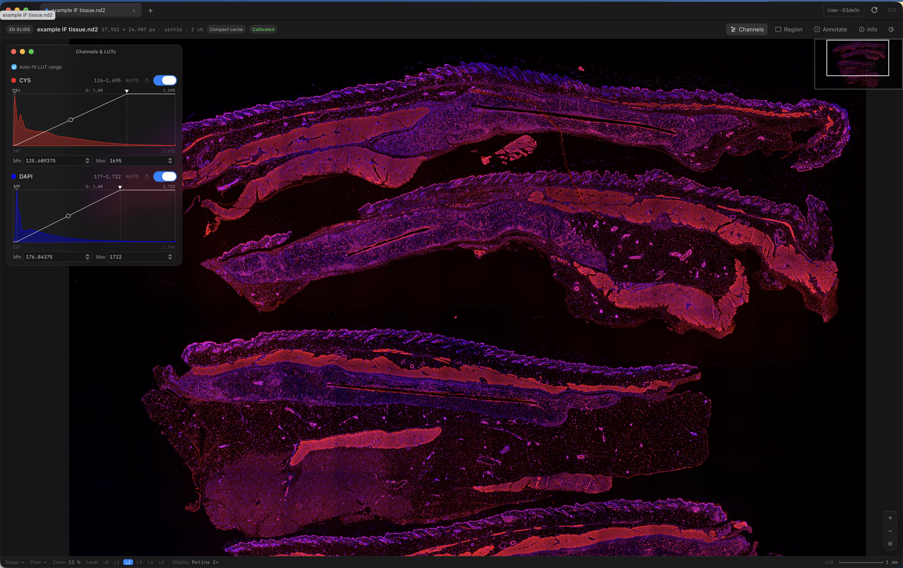
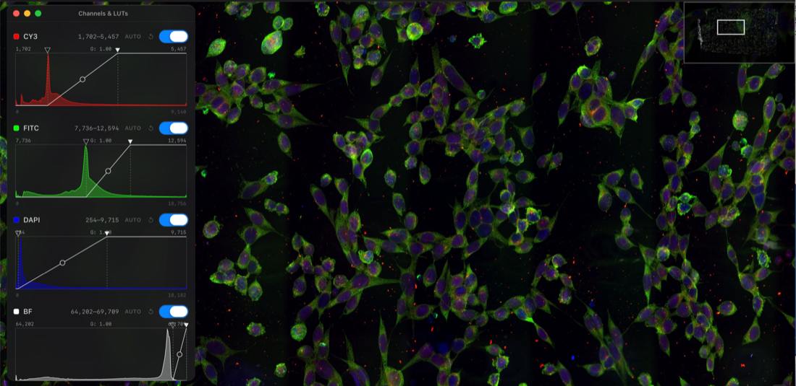
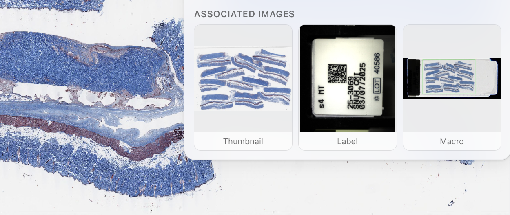
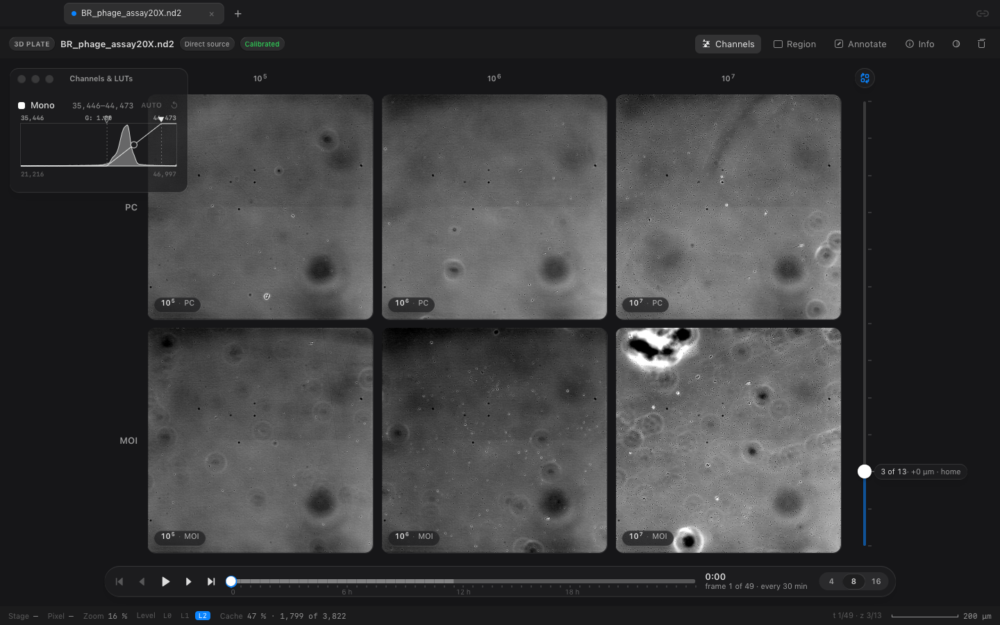
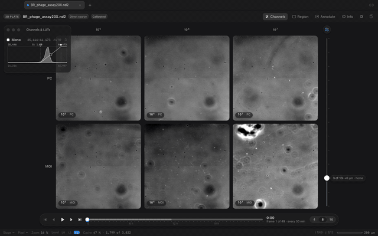
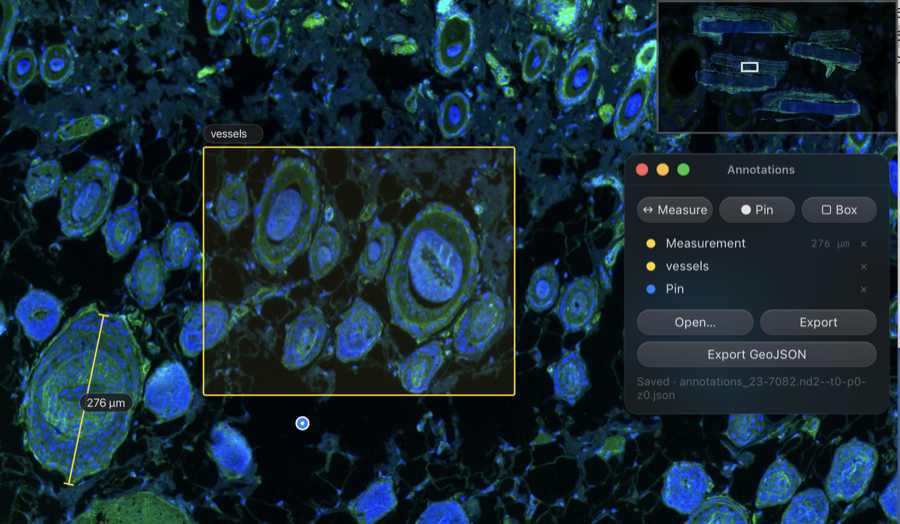
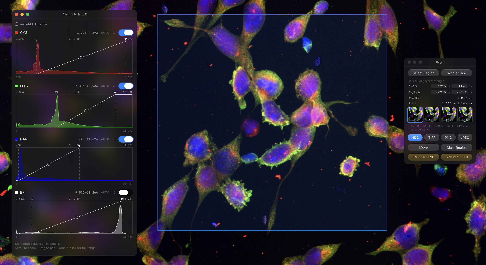
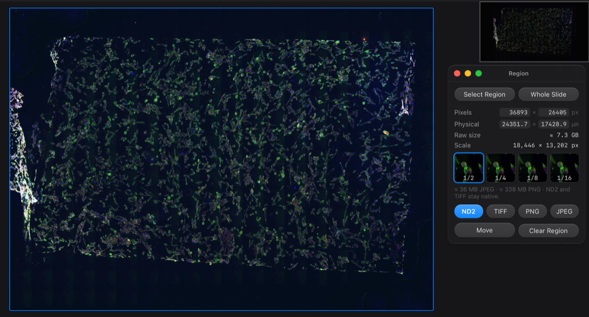
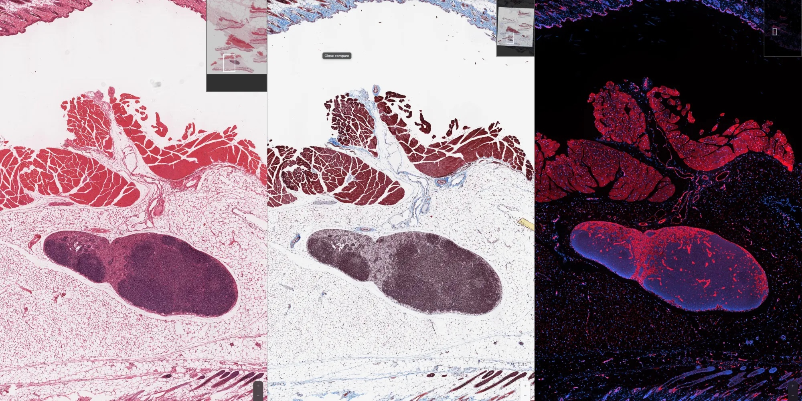
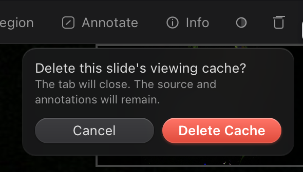

> [!NOTE]
> **Windows support is now available, including ARM PCs.**<br>
> Runs on Intel/AMD (x64) PCs and Windows 11 ARM64 PCs through x64 emulation, including Parallels on Apple silicon.<br>
> [Download the Windows installer (.exe)](https://github.com/myunghyunj/nd2wsi-viewer/releases/download/v1.2.8/nd2wsi-viewer-1.2.8-Setup.exe) · [Windows installation guide](#windows-intel-amd-and-arm-pcs)

<p align="center">
  
</p>

<h1 align="center">nd2wsi-viewer</h1>

<p align="center">
  <strong>A fast slide viewer for Nikon ND2 scans and Aperio SVS slides, on macOS and Windows.</strong><br>
  Open a scan, fly from the whole slide to single cells, measure, mark, and cut out what you need.
</p>

<p align="center">
  
  
  
  
</p>



## Why this exists

The Nikon NIS-Elements Viewer is heavy on memory and slow to move around a large scan, so looking at a slide takes longer than it should. This viewer was built to open the same files with almost no waiting and a simple screen.

The reason the Nikon viewer feels heavy is the file itself. A stitched `.nd2` scan stores the slide as one flat picture at full resolution. The scanner shoots a grid of fields and stitches them into that single plane, and the file keeps no smaller copies of it. Any viewer has to read the whole plane before it can show even an overview.

An Aperio `.svs` slide is built the other way. It keeps the same picture at a few fixed reduced sizes, like a pyramid. A viewer reads a small copy when you are zoomed out and only the full-resolution tiles on screen when you are zoomed in. That is what makes whole-slide viewers feel instant.

nd2wsi-viewer gives an ND2 scan that pyramid. It builds the reduced copies once, beside the file, and never touches the original. The full-resolution pixels are read straight from the ND2. The price is disk space for the reduced copies, about a quarter of the size of the ND2. An SVS already carries its pyramid and opens with no conversion at all.

Nothing leaves your computer. There is no upload and no account.

## What you get

- Opens stitched Nikon `.nd2` scans and Aperio `.svs` slides, several at once in tabs.
- Keeps each viewing cache in one `.nd2svs` file, easy to copy to an external SSD.
- Plays a time series of a plate, with every site at any z plane and any time, straight from the ND2.
- Follows the sharpest plane of each site through a time lapse, so focus drift over a day does not blur the series.
- Moves from the whole slide to single cells without stutter.
- Shows each fluorescence channel in its own color, with brightness range, gamma, and an on/off switch.
- Reads the raw pixel values under your cursor.
- Measures distances in micrometers, using the calibration stored in the file.
- Marks the slide with pins, rulers, and boxes, and keeps them in a small file beside the slide.
- Cuts out any region as ND2, TIFF, PNG, or JPEG, or exports the whole slide at a reduced size.
- Puts up to four slides of the same case side by side and keeps them in step while you move.
- Aligns serial sections with four clicked points.
- On macOS, checks once a day for signed GitHub releases and always asks before installing one.

## Get started

### Windows (Intel, AMD, and ARM PCs)

Download [nd2wsi-viewer-1.2.8-Setup.exe](https://github.com/myunghyunj/nd2wsi-viewer/releases/download/v1.2.8/nd2wsi-viewer-1.2.8-Setup.exe)
and its [SHA-256 checksum](https://github.com/myunghyunj/nd2wsi-viewer/releases/download/v1.2.8/nd2wsi-viewer-1.2.8-Setup.exe.sha256).
Run Setup to install the app for your Windows account. Python and scientific
libraries are included; no separate Python installation or GPU is required.
Use the Start Menu or Desktop shortcut to open the app, and Windows Settings >
Apps to uninstall it. Images, annotations, and viewing caches are preserved.

The x64 app targets Windows 10 version 1709 or later and Windows 11 on
Intel/AMD. On Windows 11 ARM64, including Snapdragon and Parallels on Apple
silicon, it uses Windows x64 emulation. The exact installer was verified on
Windows 11 ARM64; actual Windows 10 Education and separate native x64 hardware
were not tested in that run. .NET Framework 4.6.2 or later and Microsoft Edge
WebView2 Runtime are required. Setup can install missing WebView2 with an
Internet connection.

Use **Ctrl** in place of the Mac **⌘** shortcuts below, and **Alt** for
**Option**. Open files using `+`, drag and drop, or pass a file to the executable.
Windows uses its standard title bar and window buttons. Updates are installed
manually from [Releases](https://github.com/myunghyunj/nd2wsi-viewer/releases);
Windows does not use the macOS Sparkle updater.

The app and Setup are not Authenticode-signed, so Windows may display an
unknown-publisher warning. See [Windows distribution and verification](docs/windows.md)
for requirements, tested behavior, and build instructions.

### macOS (Apple silicon)

1. Download `nd2wsi-viewer.dmg` from the [latest release](https://github.com/myunghyunj/nd2wsi-viewer/releases/latest) and drag the app into Applications. It runs on Apple silicon Macs.
2. On the first launch macOS may refuse to open the app because it is not notarized with Apple. Open System Settings, go to Privacy & Security, and choose Open Anyway next to the message about nd2wsi-viewer. This happens once. On older systems, right-click the app and choose Open.
3. Drop an `.nd2` or `.svs` file onto the window, or press `+` to browse.

Version 1.2.1 is the first release that contains the updater, so it must be
installed from the DMG once. After that, use the circular-arrow button in the
tab bar or **nd2wsi-viewer → Check for Updates…**. The app checks quietly once
a day and shows Sparkle's standard update window only when a newer signed
release exists; it never installs an update without asking.

The first time you open an ND2 scan the viewer builds its reduced copies. A 3 GB scan takes well under a minute on a laptop, and the next open is instant. An SVS opens right away.

### Try it with the example scans

Two small Nikon Ti2 acquisitions are published for testing, free to use under CC0.

| File | Channels | Size | Download |
|---|---|---|---|
| `example_cell.nd2` | CY3, FITC, DAPI | 28 MB | [example_cell.nd2](https://github.com/myunghyunj/nd2wsi-viewer/releases/download/testdata-v1/example_cell.nd2) |
| `example_tissue.nd2` | CY5, DAPI | 47 MB | [example_tissue.nd2](https://github.com/myunghyunj/nd2wsi-viewer/releases/download/testdata-v1/example_tissue.nd2) |

Drop either one onto the app.

## Looking at a slide



Every fluorescence channel has its own row in the Channels panel. Pick a color, turn the channel on or off, and drag the two triangles under the histogram to set the darkest and brightest values shown. The round knob bends the curve between them, which is gamma. `Auto` sets the range for you. Its lower end sits on the background peak of the histogram, so the background goes black and the signal stands out. Hold Shift while dragging to move every channel together.

A color brightfield slide such as an H&E opens with a light window, and a fluorescence scan opens with a dark one. You can switch either way with the appearance button.

Move the cursor over the slide and the status bar shows the raw value of every channel at that pixel, straight from the file. Press `I` for a small readout that follows the cursor.



Press `⌘I` for Slide Info. It lists the pixel size and where it came from, the objective, the size of the scan, and the space the reduced copies take on disk. For an SVS it also shows the label and the macro photo stored inside the file.

The window has no title bar of its own, so the tab strip and the toolbar take its place. Double-click either one to zoom the window, as you would a title bar, and double-click again to bring it back. The gesture follows the title bar setting in System Settings under Desktop & Dock.

The mark at the left of the toolbar names the kind of file in two words. 2D or 3D says whether the file holds a z stack, and SLIDE or PLATE says whether it holds one scan position or several. A stitched scan reads 2D SLIDE and the phage assay reads 3D PLATE.

### Time series of a plate



Some ND2 files are not scans. A time lapse of a plate stores one camera field per site, repeated over z planes and over time, and there is nothing to stitch. The viewer opens such a file in plate mode and reads every frame straight from the ND2. The only thing it writes is a small store of reduced frames beside the file, about two percent of the ND2, which fills in the background so the series becomes instant to scrub. The status bar counts it up while it fills, and the trash button removes it. Once the store is full its frames are read into memory in the background, one chunk per time point and plane, so a scrub of z or time never waits on the drive.



The sites sit in a grid. Coordinate names such as `A01` become lettered and numbered row and column headers, so a label does not cover every small image. Lab patterns such as `10(5)_MOI` still become condition and dilution headers. The transpose button swaps rows and columns, and the choice is remembered. The slider on the right is the z plane, and the capsule under the grid is time. A plate with only one z plane or one time point hides the corresponding control automatically. The toolbar's **View** menu can show or hide Site Labels, Timeline, and Z Axis at any time.

Autofocus compares every Z plane for each site and time point. It uses the gradient detail of the mean image of all raw channels, independently of the visible channel selection. The toolbar button becomes available when a current site's full Z curve is ready, and remains accessible when the timeline is hidden. Only complete curves are applied: the grid reports `AF 4/6 ready`, with incomplete sites staying at the manual plane. The Z readout shows the range of planes actually displayed. Reaching for the Z control returns to a shared manual plane; in focused mode it steps from that site's displayed plane. A single-position acquisition opens focused, and a single-Z file hides autofocus.

Two gestures do most of the work. Over the grid, a vertical scroll moves through z and a horizontal swipe on the trackpad scrubs time. Click a site, or press its number, and it fills the stage as a deep zoom, where a vertical scroll zooms, a horizontal swipe still scrubs time, and Option with a vertical scroll moves through z. With keyboard focus on a grid cell, arrows move between sites and Enter opens one. On the image stage, arrows step z and time, Space plays, and Esc or the All sites capsule returns to the grid. Time and Z controls also support keyboard adjustment and announce their values to assistive technology.

In the deep zoom the ruler, pins, boxes, pixel values, and region export all work on the frame you are looking at. Marks are kept per site in a small file beside the ND2 and are shared across time and z planes. Slide Info lists the sites and their arrangement, the z planes with their step and home, the length of the series and the interval between frames, and the exposure.

The grid has no implicitly selected site. Choose a site to measure pixels, view its histogram or use Auto LUT, edit/import/export annotations, or export a region. Manual channel visibility, window and gamma controls still apply to every site in the grid. A plate's **Full Field** export is the selected site's current T/Z frame. Changing sites clears the region; changing T/Z within one site keeps its geometry and refreshes the preview. Pending pixel and histogram responses from an older frame cannot replace the current result.

## Measuring and marking



Press `M` and drag for a ruler, `P` for a pin, and `B` for a box. Each mark can carry a note.

The ruler is honest about its numbers. It counts full-resolution pixels between its two ends and multiplies by the micrometers per pixel that the file itself recorded, the voxel size in an ND2 or the MPP tag in an SVS. If a file carries no trustworthy calibration, the ruler reports pixels instead of inventing a number.

Marks are saved automatically in a small `.json` file beside the slide, so they come back the next time you open it and can be shared with the file. Press `⌘⇧E` to export them as GeoJSON, which QuPath imports directly.

## Cutting out a region



Press `R` to open the Region panel, choose **Select Region**, and drag a box, or type a size in pixels or micrometers. Then choose a format.

| Format | What you get |
|---|---|
| ND2 | the original numbers of the selected channels, as a new ND2 file |
| TIFF | the original numbers, as a tiled TIFF |
| PNG or JPEG | a picture of the region exactly as it looks on screen |

ND2 and TIFF keep the raw values, so what you export is what the scanner recorded. PNG and JPEG apply your colors and brightness settings, which makes them right for figures and wrong for measurement.



The `Full` button selects the entire slide. A very large picture export is made at a reduced size instead of at native resolution, and the panel tells you the size it will produce.

## Comparing scans and serial sections



From left: H&E, Masson's trichrome, and CD31 immunofluorescence of the same case, linked. Moving any one pane moves the other two.

Open two or more slides of the same case, press `⌘\`, and choose which slide to link with the one in front. Press `+` in the capsule to link more, up to four in all, so a reference section can sit beside CD31, CD68, and an H&E at the same time. Two slides share the screen, three take a column each, and four fill a grid. When you move one, the others follow in micrometers.

Scans taken through opposite sides of the glass may need a reflection, not just a rotation. In Compare, choose the image in **Active linked slide**, then use **Flip ↔** (`⌘F`), **Flip ↕**, **↶ 90°**, **↷ 90°** (`⌘R`), or **Transpose** (swap the displayed horizontal and vertical axes). These are image-orientation controls, distinct from transposing the well grid. The reference stays fixed; only the selected linked image changes, around the current view center. **Reset Orientation** restores its original orientation without resetting that center. The viewer does not guess the orientation from `.svs` or `.nd2` filenames. Pair orientations are remembered while the app remains open.

The comparison toolbox's **×** only hides the tools: the linked panes and their alignment stay active. Use the **Show comparison tools** sliders button beside the tab-bar link button to reopen them. The tab-bar **link** button (or `⌘\`) ends the comparison; the link button inside the toolbox pauses/resumes linked movement without closing the panes. Hiding tools also preserves an in-progress landmark edit, which can be resumed by reopening the toolbox.

To refine the alignment, press **Align** and click the same four structures on every image, in the same order. The viewer fits rotation, uniform scale and shift, preserving the current mirror state unless **Infer mirror** is selected. This is similarity alignment, not perspective or deformable registration. Landmark residuals are shown in micrometers when calibrated (relative units otherwise). **Done** commits a valid draft; **Cancel** preserves the previous alignment. **Clear Points** clears only the draft. A fitted image's orientation buttons and shortcuts remain protected until **Remove Fit** removes the committed fit. These are display transforms: source pixels, annotation coordinates, and raw exports remain unchanged.

Even a good alignment drifts by a few cells at high magnification. While linked, the arrow keys move the linked slide by one screen pixel, Shift with an arrow by ten, and an Option-drag moves one pane alone. Each nudge becomes part of the alignment.

This is a navigation and manual similarity-alignment aid, not automatic or deformable image registration. Matching orientation alone does not establish pixel correspondence. For serial sections it never claims that cells in sections separated in depth are the same cells.

## What the viewer writes on your disk

Everything the viewer makes goes into one folder beside the slide.

```text
experiment/
├── slide.nd2
└── nd2wsi/
    ├── annotations/     your pins, rulers, boxes, and notes
    └── caches/
        └── slide.nd2--t0-p0-zmid.nd2svs
```

Version 2.0 stores each cache as one `.nd2svs` file. It contains the manifest,
OME-Zarr v2 metadata and compressed image chunks in an application-owned SQLite
container, with no permanent companion database files. This avoids the allocation
overhead of thousands of small files on external drives. Open the source scan or
the `.nd2svs` file directly in the viewer; no unpacking is required.

The original scan is never modified. A compact cache contains reduced levels,
**not the original full-resolution ND2**. Move the scan and its `nd2wsi` folder
together to retain native-resolution viewing and annotations. Moving only a
compact cache allows overview-only viewing, with annotation editing disabled
until the matching source is available. Pins, rulers and ROIs remain separate in
`nd2wsi/annotations/` and are never discarded with the cache.

Older directory caches remain readable. Opening a source scan with a matching
managed scan-pyramid directory cache creates a verified single-file copy and
keeps the old directory; deletion of the old copy is a separate explicit cleanup.
Legacy multi-site plate directory caches are reused read-only without conversion.
Portable `.ome.zarr` exports
remain supported and are not converted or removed automatically. A tiled SVS
normally needs no additional cache.



The trash-can button removes the reduced copies of the slide in front. The scan and your marks stay. The copies are simply rebuilt the next time you open the file.

## Keyboard

Shortcuts act on the image workspace. They are ignored while typing in a text field, editing a note, or composing text with an input method (IME), so normal text-entry shortcuts remain available.

### Panels and tools

| Key | Action |
|---|---|
| `C` | show or hide Channels & LUTs |
| `R` | show or hide Region |
| `A` | show or hide Annotations |
| `M` | measure |
| `P` | place a pin |
| `B` | draw a box |
| `V` | move the selected region |
| `0` | fit the slide |
| `I` | pixel values under the cursor |
| `⌘I` | Slide Info |
| `⌘1` … `⌘9` | switch to that tab |
| `⌘⇧E` | export marks as GeoJSON |
| `Esc` | cancel the active tool, or return to all sites |

### Orientation and comparison

| Key | Action |
|---|---|
| `⌘R` | rotate the image 90° clockwise on screen |
| `⌘F` | flip the image horizontally on screen |
| `⌘\` | link slides |
| `L` | pause or resume the link |
| `←` `→` `↑` `↓` | nudge the linked slide by a pixel, ten with Shift |
| `⌥` drag | move one linked pane alone |

`⌘R` and `⌘F` change the focused image when slides are unlinked. In Compare, they change the image selected in **Active linked slide**, while the reference stays fixed. They follow the same protections as the orientation buttons: choose **Remove Fit** before changing a fitted image, and open a site before orienting a plate image. They do not rotate or flip the plate grid.

In the image workspace, `⌘R` and `⌘F` take the place of browser Reload and Find. Holding either shortcut applies only one change; release and press again for another. Plain `R` still opens Region, `A` opens Annotations, and `P` places a pin.

### Plate navigation

| Key | Action |
|---|---|
| `↑` `↓` | z plane of a plate |
| `←` `→` | time frame of a plate |
| `Space` | play or pause a plate |
| `F` | follow the sharpest plane of each site |
| `1` to `9` | open a site of a plate |

These navigation shortcuts apply on the image stage; arrows instead move between sites when a grid cell has keyboard focus, and Enter opens that site. While movement is linked in Compare, arrows nudge the linked image and plate navigation shortcuts are paused. Plain `F` toggles autofocus only for an eligible plate with multiple Z planes when autofocus is ready; otherwise it does nothing. Use `⌘F` to flip an image.

## Questions and requests

### An older version freezes while installing an update

Version 1.2.8 fixes a main-thread deadlock in the app's preparation for an update. Annotation saving and file-handle cleanup now run in the background; Sparkle resumes on the main thread only after they finish. Aborted attempts cannot resume a later installation.

An older app still runs its old updater code before it can replace itself. If it freezes at this step, save your work and close the viewer, download the latest DMG from [Releases](https://github.com/myunghyunj/nd2wsi-viewer/releases/latest), and replace the app in Applications once. Keep your slide files, annotation sidecars, and viewing caches; none need to be deleted for this repair.

The viewer grew out of one lab's need for speed, so it does what that lab needed first. If something is missing or unclear, open an [issue](https://github.com/myunghyunj/nd2wsi-viewer/issues).

<details>
<summary><strong>For developers</strong></summary>

### Install from source

Python 3.11 or newer.

```bash
python -m pip install ".[app,svs]"
```

ND2 export needs Laboratory Imaging's package index.

```bash
python -m pip install ".[nd2export]" \
  --extra-index-url https://pypi.laboratory-imaging.com/simple
```

### Command line

```text
nd2wsi info FILE
nd2wsi view FILE [FILE ...]
nd2wsi convert FILE [OUTPUT.ome.zarr]
nd2wsi crop INPUT.nd2 OUTPUT.nd2 --x X --y Y --w W --h H [--c 0,2]
nd2wsi serve STORE [STORE ...]
nd2wsi tidy FOLDER [FOLDER ...]
```

`view` opens the browser UI on a local port. `convert` writes a portable OME-Zarr pyramid with every level. `crop` cuts a native ND2 region with no pyramid at all.

### How it works

An eligible ND2, meaning a modern uncompressed file with one stored T/P/Z plane, gets a compact cache that holds only the reduced levels, while level 0 is the ND2 itself read through its memory map. Compressed and legacy files fall back to a full pyramid. A tiled SVS is served from its own embedded pyramid. An ND2 of camera fields over time, sites, or z planes opens in plate mode, where each frame is read from the file with one sequential read and its reduced copies live in a small zarr store beside the file, one chunk per time point and plane, warmed into memory once it is full. A small server on loopback, behind a random capability URL, hands tiles to OpenSeadragon. Regions are read from the raw tiles for TIFF and ND2 export and rendered for PNG and JPEG.

Rebuilding a working set of 39 scans totalling 190 GB measured the trade. Full pyramids took 152 GB, compact caches 36 GB, and a cold 512 px native window from the largest scan read in 170 ms.

### Development

```bash
uv sync --all-extras
uv run ruff check nd2wsi tests
uv run pytest -q -m "not realdata"

python scripts/fetch_testdata.py
uv run pytest -q -m realdata

ND2WSI_SMOKE_FILE=docs/example_cell.nd2 packaging/build_mac_app.sh dist
```

CI tests Python 3.11 through 3.13, runs Ruff, builds and installs the wheel, and runs the real-data suite on every tag.

Alignment/Compare now keeps landmark drafts separate from committed geometry, requires four valid corresponding points before Done, and scopes spatial commands and remembered fits to the current pane/source/site. Clear Points, Reset Orientation, and Remove Fit have separate meanings. Physical links that cannot be represented by the renderer are blocked; Relative mapping is an explicit display-only choice. ROI previews show the final source-aligned export rectangle, and the scalebar accounts for display rotation and X/Y calibration. See [v1.2.6 validation](docs/v1.2.6-validation.md) for coverage and limitations.

### Prior work

- [`tlambert03/nd2`](https://github.com/tlambert03/nd2) for ND2 reading and metadata
- [`Laboratory-Imaging/limnd2`](https://github.com/Laboratory-Imaging/limnd2) for ND2 writing
- [`girder/large_image`](https://github.com/girder/large_image) as the direct ND2 tile-source reference
- [OME-NGFF](https://ngff.openmicroscopy.org/) for multiscale metadata
- [OpenSeadragon](https://openseadragon.github.io/) for deep zoom
- [tifffile](https://github.com/cgohlke/tifffile) for TIFF and SVS access

</details>

## License

MIT. The example acquisitions are CC0, described in `TESTDATA_LICENSE.md`. OpenSeadragon is included under its BSD-3-Clause license.
